# Merzenich Aktuell – Bedienungsanleitung für die Redaktion

Stand 7. Oktober 2026 · für die Redaktion der KBS Management GmbH

Merzenich Aktuell läuft als WordPress-Seite auf **merzenich-aktuell.de**. Alles, was die Redaktion tut, passiert im Backend unter **merzenich-aktuell.de/wp-admin**. Diese Anleitung beschreibt die Handgriffe Schritt für Schritt. Die Beschriftungen in **fett** stehen genau so im Backend.

- **Teil A** ist für alle in der Redaktion (Rolle „Redakteur“).
- **Teil B** ist für Administratoren: Konten, Partner, Einstellungen.
- Der **Anhang** fasst die Regeln für Text und Bild auf einer Seite zusammen und hilft bei Problemen.

## So ist die Seite aufgebaut

**Ressorts:** Nachrichten (alle Meldungen), Blaulicht, Rathaus & Politik, Leben, Wirtschaft, Vereine, Sport und Menschen. Dazu kommen Termine, Stellen (Jobs), Immobilien, Traueranzeigen, Familienanzeigen, Tipps, Unternehmen und das Vereinsverzeichnis. Jeder Ortsteil hat eine eigene Seite: Merzenich, Golzheim, Girbelsrath, Morschenich und Bürgewald.

**Startseite:** oben der **Aufmacher** (große Meldung) und die **Bühne** (vier Plätze daneben und darunter), darunter die Rubrikflächen der Ressorts. Die rechte Spalte füllt sich selbst: Termine, „Merzenich jetzt“ (nächster Termin, letzter Feuerwehreinsatz), Wetter, Foto des Tages, Umkreis, Stellen und Immobilien. Sport steht auf Wunsch von KBS nicht auf der Startseite, sondern auf merzenich-aktuell.de/sport/.

**Heute in Merzenich** (merzenich-aktuell.de/heute/) füllt sich selbst: die Termine von heute und den nächsten sieben Tagen und die neuesten Meldungen. Die Seite antwortet auf die Frage „Was ist heute in Merzenich los?“, die viele bei Google stellen.

**Wer macht was:**

| Wer | Was |
|---|---|
| Recherche (HK Growth Operator) | Sammelt jeden Tag neue Meldungen aus amtlichen Quellen, Feuerwehr, Polizei und Vereinen. Sie kommen als **Entwurf** ins Backend. |
| Redaktion (Teil A) | Prüft und gibt frei, schreibt eigene Meldungen, ordnet die Startseite, pflegt Sport, Anzeigen und Kommentare. |
| Partner (Polizei, Feuerwehr, Gemeinde, Vereine, Firmen) | Reichen über eigene Zugänge Meldungen, Termine und Anzeigen ein. Veröffentlichen können sie nicht. |
| Administratoren (Teil B) | Legen Konten an, verwalten Partner und Einstellungen. |

**Die wichtigste Regel:** Keine Meldung geht ohne die Freigabe eines Menschen online. Das System sperrt jede Meldung, solange die Prüfhaken fehlen.

---

# Teil A – Redaktion

## A1. Anmelden

1. **merzenich-aktuell.de/wp-admin** aufrufen.
2. Benutzername oder E-Mail-Adresse und Passwort eingeben, **Anmelden**.
3. Abmelden: oben rechts auf den eigenen Namen zeigen, **Abmelden**.

Jede Person arbeitet mit ihrem eigenen Konto. Wer eine Meldung freigibt, steht als Autor darüber (Teil B, Abschnitt B1). Ein geteiltes Konto erscheint nur als „Redaktion Merzenich Aktuell“.

Passwort vergessen: auf der Anmeldeseite **Passwort vergessen?**. Das klappt nur, wenn der Mailversand eingerichtet ist (B4). Sonst setzt ein Administrator ein neues Passwort.

## A2. Der Arbeitstag in fünf Schritten

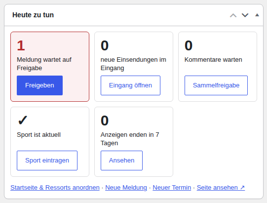

Nach dem Anmelden öffnet sich das **Dashboard**. Ganz oben steht die Kachel **Heute zu tun**. Eine rot umrandete Zahl heißt: Hier wartet etwas.

| Kachel | Was zu tun ist |
|---|---|
| **Meldungen warten auf Freigabe** → **Freigeben** | Neue Meldungen aus der Recherche und von Partnern prüfen (A3). |
| **neue Einsendungen im Eingang** → **Eingang öffnen** | Leserhinweise, Termine, Anzeigen, Fotos (A7). |
| **Kommentare warten** → **Sammelfreigabe** | Kommentare prüfen (A8). |
| **Sportergebnis fehlt** → **Sport eintragen** | Ergebnis des letzten Spiels nachtragen (A10). |
| **Anzeigen enden in 7 Tagen** → **Ansehen** | Kunden ansprechen, ob sie verlängern (A12, A13). |

Darunter stehen die Kästen **Live** (wer gerade auf der Seite ist) und **Redaktion: Freigaben und Abgleich** (wann die letzte Recherche ankam).

Der Tag in fünf Schritten:
1. **Heute zu tun** ansehen.
2. **Freigaben** abarbeiten, mindestens morgens und nachmittags.
3. **Eingang** und **Kommentare** durchsehen.
4. **Startseite** ansehen und bei Bedarf umstellen (A5).
5. Nach Spielen: **Sport** eintragen.

## A3. Freigaben

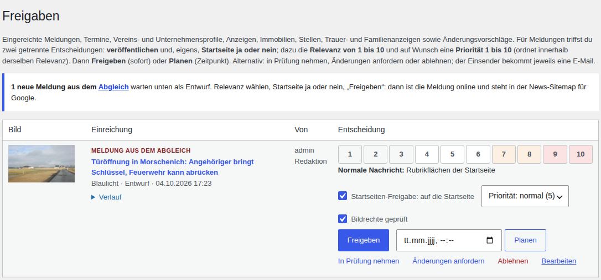

**Merzenich Aktuell → Freigaben** zeigt alles, was auf Freigabe wartet: Meldungen aus der Recherche und Einreichungen von Partnern. Die rote Zahl am Menüpunkt sagt, wie viel wartet.

**Vor der Freigabe prüfen:**
1. Die verlinkte **Quelle** öffnen. Datum, Uhrzeit, Ort und Namen mit der Meldung vergleichen.
2. Überschrift lesen: Steht dort „heute“ oder „morgen“ und der Tag ist vorbei, über **Bearbeiten** auf das Datum umstellen („am 4. Oktober“).
3. Bild ansehen: Passt es zum Thema? Symbolbilder sind als „Symbolbild“ gekennzeichnet. Ein falsches Bild lieber entfernen (Anhang, Regeln).

**Freigeben:**
1. **Relevanz** wählen, 1 bis 10. Ohne Relevanz geht die Freigabe nicht. 8 bis 10 sind Kandidaten für Aufmacher und Bühne, 4 bis 7 normale Nachrichten, 1 bis 3 Randmeldungen. Die Tabelle **Die zehn Stufen** unten auf der Seite erklärt jede Stufe.
2. **Startseiten-Freigabe: auf die Startseite** ankreuzen, wenn die Meldung auf die Startseite darf. Ohne Haken erscheint sie nur in ihrem Ressort.
3. Bei Bedarf die **Priorität** ändern. Sie ordnet Meldungen mit gleicher Relevanz.
4. **Bildrechte geprüft** ankreuzen, wenn das Bild in Ordnung ist.
5. **Freigeben** klicken.

Die Meldung ist sofort online, auf der Startseite (wenn freigegeben), im Ressort und bei Google News. Wer sich für Live-Meldungen angemeldet hat, bekommt eine Push-Nachricht aufs Handy (A15).

**Die anderen Knöpfe:**
- **Planen**: Datum und Uhrzeit wählen, die Meldung erscheint dann von selbst.
- **In Prüfung nehmen**: zeigt den Kollegen, dass jemand daran arbeitet.
- **Änderungen anfordern**: nur bei Partner-Einreichungen. Schreiben Sie in **Notiz an den Einsender**, was fehlt. Der Partner bekommt die Notiz und kann nachbessern.
- **Ablehnen**: Die Meldung wird nicht veröffentlicht. Partner bekommen eine Nachricht.
- **Bearbeiten**: öffnet die Meldung im Editor (A4).
- **Verlauf**: zeigt, wer wann was geändert hat.

**Nicht freigeben** heißt: nichts tun. Die Meldung bleibt Entwurf und schadet nicht. Was falsch oder veraltet ist, über **Bearbeiten** in den Papierkorb legen. Dann kommt sie auch mit der nächsten Recherche nicht wieder.

## A4. Eine Meldung selbst schreiben

**Beiträge → Beitrag hinzufügen** (oder im Dashboard **Neue Meldung**).

1. **Titel** und **Text** schreiben. Ortsname in den Titel und in den ersten Satz (Anhang, Regeln).
2. In der Seitenleiste:
   - **Kategorien** = Ressort (Blaulicht, Rathaus & Politik, Leben …).
   - **Orte** = Ortsteil.
   - **Schlagwörter** = wenige wiederkehrende Themen, zum Beispiel „Feuerwehr“, „Schule“, „Haushalt“. Keine Ortsteile und keine Ressorts als Schlagwort, dafür gibt es eigene Seiten.
   - Ganz oben in der Seitenleiste das **Beitragsbild** festlegen (A11).
3. Unten im Kasten **Redaktion & Quelle** ausfüllen:

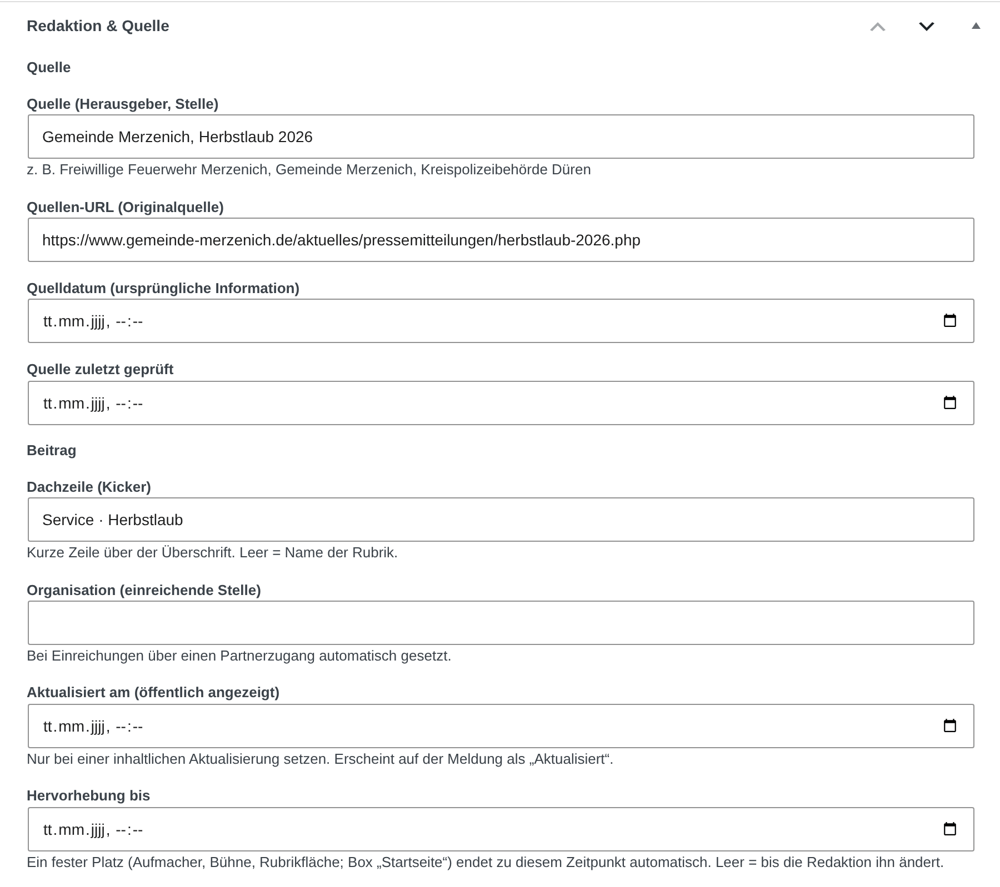

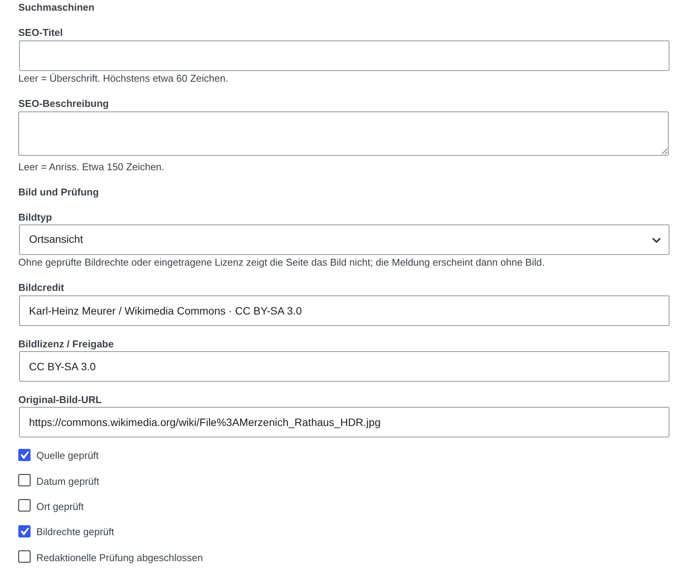

| Feld | Was hinein gehört |
|---|---|
| **Quelle (Herausgeber, Stelle)** | z. B. „Gemeinde Merzenich“, „Polizei Düren“ |
| **Quellen-URL (Originalquelle)** | Link zur Originalmeldung |
| **Quelldatum** | Datum der Originalmeldung |
| **Dachzeile (Kicker)** | kurze Zeile über dem Titel, z. B. „Feuerwehr · Türöffnung“ |
| **Aktualisiert am** | nur bei Korrekturen oder neuen Erkenntnissen (A9) |
| **Hervorhebung bis** | bis wann ein fest gesetzter Startseitenplatz gilt (A5) |
| **SEO-Titel**, **SEO-Beschreibung** | freiwillig: was Google zeigt. Ortsname vorn. |
| **Bildtyp** | Originalbild, Offizielles Bild, Lizenziertes Bild, Symbolbild oder Ortsansicht |
| **Bildcredit**, **Bildlizenz / Freigabe** | Urheber und Nutzungsgrundlage des Bildes |

4. Die fünf Haken setzen, wenn alles stimmt: **Quelle geprüft**, **Datum geprüft**, **Ort geprüft**, **Bildrechte geprüft** und **Redaktionelle Prüfung abgeschlossen**.
5. Im Kasten **Startseite** (Seitenleiste, unter den Schlagwörtern) wählen:
   - **Startseiten-Freigabe**: „Ja, auf die Startseite“ oder „Nein, nur Rubrik“.
   - **Wo steht diese Meldung?**: meist „Automatisch“, sonst ein fester Platz.
   - **Relevanz** und **Priorität**.
6. **Veröffentlichen**.

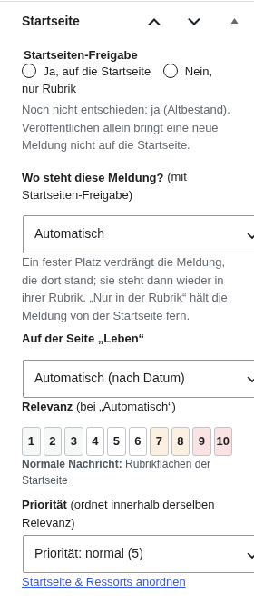 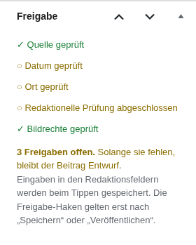

Fehlt ein Haken, bleibt die Meldung Entwurf. Oben erscheint dann: „Nicht veröffentlicht … weil diese Freigabe fehlt“. Haken setzen und noch einmal **Veröffentlichen**. Der Kasten **Freigabe** in der Seitenleiste zeigt jederzeit, was noch fehlt.

**Weitere Felder:**
- **KI & redaktionelle Transparenz**: ankreuzen, wenn KI beim Text oder Bild geholfen hat.
- **Kommentare** zu einer Meldung abschalten: in der Seitenleiste bei **Diskussion** auf den Wert klicken (meist „Nur Kommentare“) und **Geschlossen** wählen. Vorhandene Kommentare bleiben sichtbar.
- **Verlauf**: zeigt alle Änderungen mit Person und Zeit.

**Schnellweg:** Auf der Startseite oder im Board (A5) gibt es **+ Neue Meldung**. Das Formular fragt Titel, Kicker, Anriss, Text, Rubrik, Ortsteil, Bild aus der Mediathek, Bildtyp, Bildcredit, Quelle und Relevanz ab. Der Haken **Ich bestätige die Bild- und Nutzungsrechte.** ist Pflicht, wenn ein Bild dabei ist. Dann **Veröffentlichen und einsetzen** oder **Als Entwurf speichern und im Editor öffnen**.

**Wie lang?** Eine Kurzmeldung hat mindestens 80 Wörter, eine normale Meldung etwa 300, ein Hintergrundtext 700. Lieber kurz und belegt als lang und aufgefüllt.

## A5. Startseite und Ressorts anordnen

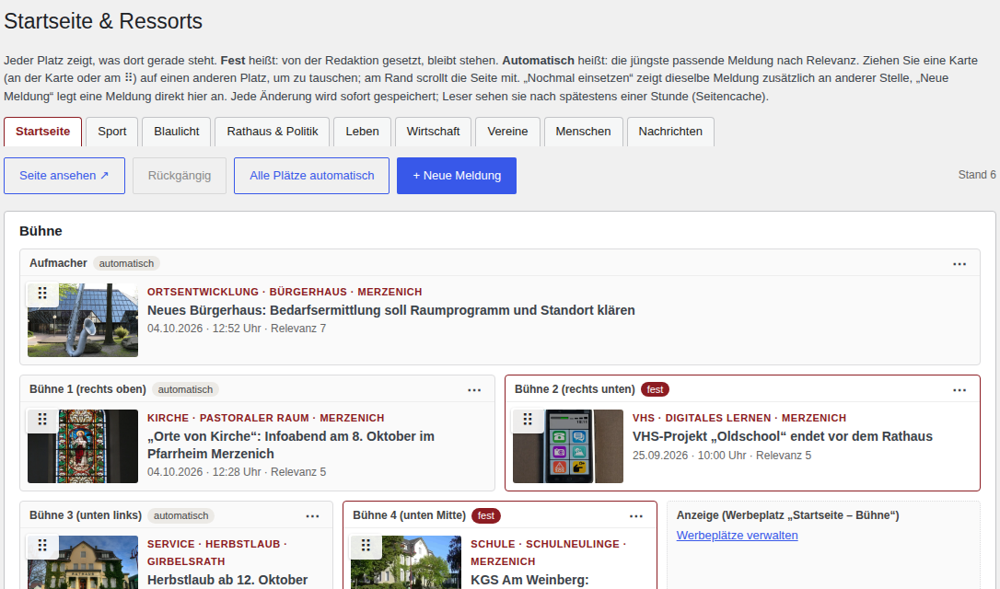

Die Startseite füllt sich selbst aus den freigegebenen Meldungen, nach Relevanz, Aktualität und Ortsbezug. Wer selbst anordnen will, öffnet **Merzenich Aktuell → Startseite & Ressorts**. Oben wählen Sie die Seite: Startseite, Sport, Blaulicht, Rathaus & Politik, Leben, Wirtschaft, Vereine, Menschen oder Nachrichten.

Jede Karte ist ein Platz. „fest“ heißt: von Hand gesetzt. „automatisch“ heißt: die Automatik wählt.

- **Ziehen:** Karte am Griff **⠿** packen und auf eine andere Karte ziehen. Die beiden tauschen die Plätze. Mit der Maus geht auch die ganze Karte. Am oberen oder unteren Rand scrollt die Seite mit. **Esc** bricht ab.
- **Kartenmenü:**
  - **Ersetzen …**: eine andere Meldung auf diesen Platz.
  - **Nochmal einsetzen …**: dieselbe Meldung bleibt, neu bestätigt.
  - **Verschieben nach …**: auf einen anderen Platz.
  - **Platz freigeben (automatisch)**: der Platz geht zurück an die Automatik.
  - **Nur in der Rubrik zeigen**: die Meldung verschwindet von der Startseite.
  - **Neue Meldung hier …**: Schnellformular für diesen Platz.
- **Leiste oben:** **Rückgängig**, **Alle Plätze automatisch**, **+ Neue Meldung**, **Seite ansehen ↗**.

Bei **Ersetzen** lässt sich jede veröffentlichte Meldung wählen. Steht sie auf „Nur in der Rubrik“, fragt das Board kurz nach und gibt sie für die Startseite frei. Entwürfe lassen sich **vormerken**: Der Platz bleibt reserviert, die Meldung erscheint dort, sobald sie freigegeben ist.

**Hervorhebung bis** (im Editor, A4): Ein fester Platz gilt bis zu diesem Zeitpunkt, dann rückt die Automatik nach.

**Direkt auf der Seite:** Angemeldet steht in der schwarzen Leiste oben **Seite bearbeiten** (auf der Startseite und auf der ersten Seite jedes Ressorts). Dann gibt es an jeder Karte **Ersetzen**, **Nochmal**, **Freigeben** (Platz zurück an die Automatik) und **Text**. Mit **Text** ändern Sie Titel und Anriss direkt: **Enter** speichert, **Esc** bricht ab. **Fertig** beendet den Modus.

**Beiträge-Liste** (Menü **Beiträge**):

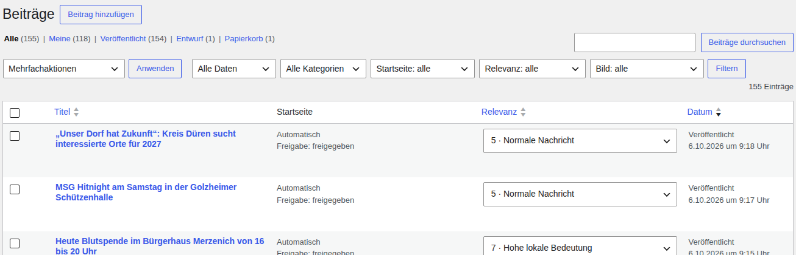

- Filter über der Liste: **Startseite** (freigegeben, noch offen, nur in der Rubrik), **Relevanz** (hoch, mittel, niedrig, ohne) und **Bild** (ohne Beitragsbild, Bildrechte nicht bestätigt). Ein Klick auf die Spalte **Relevanz** sortiert.
- Die Relevanz lässt sich direkt in der Liste ändern.
- Mehrere Meldungen auf einmal: ankreuzen, oben bei **Mehrfachaktionen** wählen: **Redaktionell freigeben und veröffentlichen**, **Bildrechte bestätigen**, **Startseite: freigeben**, **Startseite: nicht freigeben** oder **Archivieren / zurückziehen**.
- **Archivieren** (beim Überfahren einer Zeile) nimmt eine Meldung von der Seite, ohne sie zu löschen. **Wieder veröffentlichen** holt sie zurück.

## A6. Veranstaltungen (Termine)

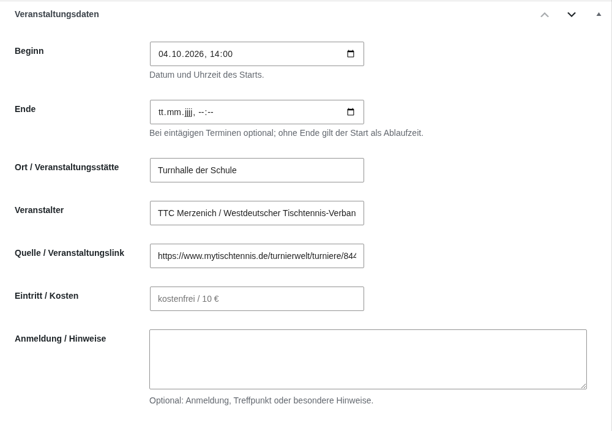

Termine heißen im Menü **Veranstaltungen**. Neuer Termin: **Veranstaltungen → Veranstaltung hinzufügen** (oder im Dashboard **Neuer Termin**).

1. Titel und kurze Beschreibung.
2. Kasten **Veranstaltungsdaten**: **Beginn**, **Ende** (frei lassen, wenn unbekannt), **Ort / Veranstaltungsstätte**, **Veranstalter**, **Quelle / Veranstaltungslink**, **Eintritt / Kosten**, **Anmeldung / Hinweise**.
3. **Ort** (Ortsteil) wählen. Bei Bedarf ein Bild mit **Bildherkunft**.
4. **Veröffentlichen**.

Termine haben keine Prüfhaken. Prüfen Sie Datum, Uhrzeit und Ort selbst an der Quelle. Nach dem Ende verschwindet ein Termin von selbst aus allen Listen, ohne Ende am Abend des Tages. Jeder Termin bietet Lesern eine Kalenderdatei an.

Termine aus der Recherche erscheinen sofort. Sehen Sie die Liste **Veranstaltungen** einmal pro Woche durch. Falsche Termine in den Papierkorb legen, sie kommen nicht wieder.

Jeder Termin steht an seinem Tag auch auf **Heute in Merzenich** (merzenich-aktuell.de/heute/). Dort fällt ein falscher Termin besonders auf.

## A7. Eingang: Einsendungen von Lesern und Partnern

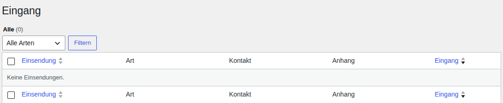

Alles, was über die Formulare der Seite kommt, steht unter **Merzenich Aktuell → Eingang**: Kontakt, Meldung, Termin, Verein, Werbung, Immobilie, Stellenanzeige, Traueranzeige, Familienanzeige, Partner-Antrag, Korrektur und Foto des Tages. Eine Einsendung wird nie automatisch veröffentlicht.

1. Einsendung öffnen und lesen. Oben stehen Absender, Anhänge und ob der Einsender die Bildrechte bestätigt hat.
2. **Als Entwurf übernehmen** legt daraus einen Entwurf an (Meldung, Termin, Anzeige). Dann wie in A4 oder A6 bearbeiten und veröffentlichen.
3. Erledigte Einsendungen: im Kasten rechts **Erledigt** ankreuzen und speichern.

Besonderheiten:
- **Foto des Tages:** Im Kasten **Foto des Tages** ein **Datum** wählen und **Als Foto des Tages einplanen**. Das geht nur, wenn der Einsender Bildrechte und Zustimmung zur Veröffentlichung bestätigt hat. An dem Tag zeigt die Startseite das Foto. Ohne eingeplantes Leserfoto zeigt sie eine Ortsansicht.
- **Anzeigen** (Immobilie, Stelle, Trauer, Familie): Angaben prüfen, mit dem Kunden Preis und Laufzeit klären, dann übernehmen (A12).
- **Partner-Antrag:** Ein Zugang entsteht nicht von selbst. Ein Administrator legt ihn an (B2).
- **Korrektur:** wird nicht übernommen, sondern bearbeitet wie in A9.

Persönliche Angaben aus Einsendungen nur für diesen Zweck nutzen und nicht weitergeben.

## A8. Kommentare

Jeder Kommentar wartet auf Freigabe. **Kommentare → Sammelfreigabe** zeigt alle wartenden, jeder ist vorausgewählt.

1. Durchlesen. Was gegen die Regeln verstößt, abwählen.
2. **Alle ausgewählten genehmigen**. Abgewählte bleiben stehen; problematische mit **Ausgewählte ablehnen** entfernen.
3. Bei vielen Seiten: **Alle wartenden genehmigen**.

**Nicht freigeben:** Beleidigungen, Hass, Drohungen, private oder sensible Angaben über Dritte, Spam und rechtswidrige Inhalte. Wer eine E-Mail-Adresse angegeben hat, bekommt nach der Freigabe eine Nachricht. Die E-Mail-Adresse wird nie veröffentlicht. Die Regeln stehen öffentlich unter merzenich-aktuell.de/kommentarregeln/.

Kommentare unter einer bestimmten Meldung abschalten: siehe A4.

## A9. Korrekturen

Fehler kommen über **Fehler melden** unter jeder Meldung oder per E-Mail. Im Eingang haben sie die Art „Korrektur“.

1. Den Hinweis an der Quelle prüfen.
2. Die Meldung im Editor korrigieren.
3. **Aktualisiert am** auf jetzt setzen. Die Meldung zeigt dann „Aktualisiert …“.
4. Bei einem sachlichen Fehler unter den Text einen Satz setzen: „Korrektur vom 7. Oktober: In einer früheren Fassung stand …“.
5. Wesentliche Fehler trägt ein Administrator in die Liste auf der Seite Korrekturen ein (merzenich-aktuell.de/korrekturen/).

Eine Meldung wird nie kommentarlos gelöscht. Ist sie im Ganzen falsch: **Archivieren** und auf der Seite Korrekturen vermerken.

## A10. Sport

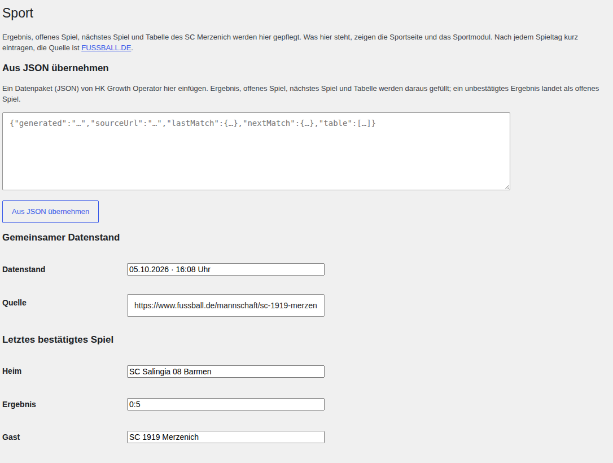

**Merzenich Aktuell → Sport** pflegt Ergebnis, nächstes Spiel und Tabelle des SC 1919 Merzenich (Kreisliga A).

1. **Gemeinsamer Datenstand**: Datum und Uhrzeit der Prüfung, **Quelle** (Link zu FUSSBALL.DE).
2. **Letztes bestätigtes Spiel**: **Heim**, **Ergebnis**, **Gast**, **Datum / Uhrzeit**, **Spielbericht (Link)**.
3. **Noch nicht bestätigtes Spiel**: ein Spiel, dessen Ergebnis noch nicht feststeht.
4. **Nächstes Spiel**.
5. **Tabelle**: Platz, Mannschaft, Spiele, Siege, Unentschieden, Niederlagen, Punkte, Tore.
6. **Sportdaten speichern**. Die Sportseite zeigt den neuen Stand sofort.

Nur belegte Werte eintragen, nie ein Ergebnis schätzen. Ist ein Spiel seit drei Stunden vorbei und kein Ergebnis eingetragen, erscheint im Dashboard „Sportergebnis fehlt“.

**Aus JSON übernehmen** füllt das Formular aus einem Datenpaket, das HK Growth Operator schickt. Danach prüfen und speichern.

Unter „Wer spielt wo“ zeigt die Sportseite alle aktiven Vereine der Gemeinde mit Liga, Platz und Punkten. Diesen Stand pflegt HK Growth Operator einmal täglich. Fehlt eine Mannschaft, genügt ein Hinweis mit Link zur Tabelle.

## A11. Bilder und Bildpools

**Grundsatz: Lieber kein Bild als ein falsches.** Eigene Fotos vom Ereignis gehen immer vor. Selbst gezeichnete Grafiken gibt es nicht.

**Ein Foto hochladen** (**Medien → Mediendatei hinzufügen**, oder im Editor beim Beitragsbild):
1. Datei hochladen. Querformat, mindestens 1600 Pixel breit.
2. Rechts die Felder füllen: **Fotograf / Urheber**, **Quelle**, **Nutzungsgrundlage (eigenes Foto, Lizenz, Freigabe …)** und den Alternativtext (was ist zu sehen).
3. **Bildrechte: redaktionelle Prüfung** auf **Geprüft** stellen, wenn Urheber und Nutzungsrecht klar sind. Alle Meldungen mit diesem Bild gelten dann als „Bildrechte geprüft“.
4. Bei Bedarf einen **Bildpool** eintragen, damit das Foto auch für andere Meldungen zur Wahl steht.

**Prüfen vor jedem Foto:** kein erkennbares Gesicht ohne Einwilligung, kein lesbares Autokennzeichen, keine Hausnummer, kein Firmenschild oder Logo als Motiv, kein Bild aus dem Ausland für ein Ereignis hier.

**Bildpools** (Medien → Bildpools) sind geprüfte Symbolfotos je Thema: Blaulicht, Brand, Polizei, Verkehr, Gemeinde, Schule, Kirche, Vereine, Sport und weitere. Wird eine Meldung ohne Beitragsbild veröffentlicht, setzt das System selbst ein geprüftes Foto aus dem passenden Pool, gekennzeichnet als „Symbolbild“.

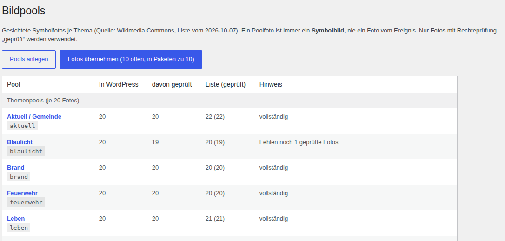

- In der **Mediathek** oben **Alle Bildpools** wählen, um nur einen Pool zu sehen. Das geht auch im Fenster **Beitragsbild festlegen**.
- Fotos mit „Abgelehnt – nicht verwenden“ stehen in keinem Pool mehr.
- Der **Aufmacher** der Startseite soll ein eigenes Foto oder ein Foto der Quelle tragen, kein Symbolbild.
- Fehlt ein Motiv (zum Beispiel Türöffnung, Baustelle, Flutlicht), bitte HK Growth Operator Bescheid geben.

## A12. Anzeigen: Stellen, Immobilien, Trauer, Familie, Tipps

Jede Anzeigenart hat ihr eigenes Menü und einen eigenen Kasten mit Feldern. Zwei Felder gelten für alle:

- **Anzeige endet** (bei Tipps **Platzierung endet**): Danach verschwindet die Anzeige von selbst aus allen Listen.
- **Freigabe dokumentiert**: Ohne diesen Haken bleibt die Anzeige Entwurf. Setzen Sie ihn erst, wenn die Freigabe des Auftraggebers schriftlich vorliegt (E-Mail genügt).

| Art | Menü | Besonderheiten |
|---|---|---|
| Stelle | **Stellen** | Unternehmen, „Wer inseriert?“, Arbeitsort, Beschäftigungsart, Bewerbungslink |
| Immobilie | **Immobilien** | Mieten oder Kaufen, Preis, Zimmer, Fläche, Lage, Anbieter |
| Traueranzeige | **Traueranzeigen** | nur mit Einwilligung der Familie; **Interner Kontakt** erscheint nie auf der Seite; nicht in Suchmaschinen |
| Familienanzeige | **Familienanzeigen** | Anlass (Geburt, Hochzeit, Jubiläum …); Einwilligung der Genannten |
| Tipp | **Tipps** | **Kennzeichnung**: Tipp, Sponsoring oder Anzeige; **Sponsor / Auftraggeber** |

**Stellen und Immobilien aus der Marktprüfung:** Viele Einträge unter Stellen und Immobilien übernimmt das System täglich aus geprüften Quellen, mit Quelle und Prüfdatum. Sie enden von selbst: Stellen 30 Tage, Immobilien 35 Tage nach der letzten Prüfung. Fällt ein Angebot aus der Quelle, endet es am selben Tag. Eigene Anzeigen von Kunden stehen getrennt und werden nicht angefasst.

## A13. Werbung

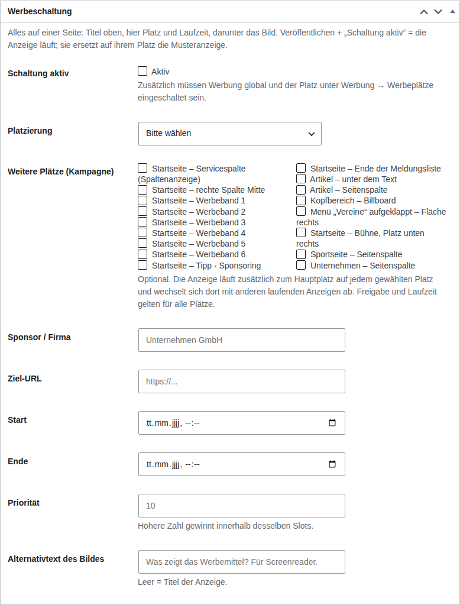

Jeder freie Werbeplatz zeigt eine gekennzeichnete **Musteranzeige**. So sieht ein Kunde, wo seine Anzeige erscheint.

**Anzeige schalten:** **Werbung → Werbemittel hinzufügen**.
1. Titel (intern, z. B. „Bäckerei Muster Herbst 2026“).
2. **Werbemittel (Bild)**: Bild hochladen, **Alternativtext des Bildes** eintragen.
3. Kasten **Werbeschaltung**: **Sponsor / Firma**, **Ziel-URL**, **Start**, **Ende**, **Platzierung**. Für mehrere Plätze zusätzlich **Weitere Plätze (Kampagne)**. **Priorität**, wenn sich mehrere Anzeigen einen Platz teilen.
4. **Aktiv** (Schaltung aktiv) ankreuzen, **Veröffentlichen**.

Eine Anzeige läuft nur, wenn sie veröffentlicht und aktiv ist, das Startdatum erreicht ist und Werbung sowie der Platz eingeschaltet sind (Werbeplätze, B5). Nach dem Ende kommt die Musteranzeige zurück.

**Gesponserte Beiträge:** Im Editor im Kasten **Kennzeichnung** **Gesponserter Beitrag** ankreuzen und den **Auftraggeber** nennen. Die Meldung trägt dann sichtbar „Anzeige“ und nennt den Auftraggeber statt der Redaktion. Gesponserte Beiträge lösen keine Push-Nachricht aus.

**Unternehmensprofile** (Menü **Unternehmen**) nur mit schriftlicher Einwilligung des Betriebs: Haken **Einwilligung**, sonst wird das Profil nicht veröffentlicht.

**Preise** stehen nirgends auf der Seite. Dort steht immer „Preis auf Anfrage“.

## A14. Statistik und Live

**Merzenich Aktuell → Statistik** zeigt die Zugriffe. Oben **Zeitraum**: **Heute**, **Letzte 7 Tage**, **Letzte 30 Tage** oder ein eigener Zeitraum.
- **Website**: Besucher und Aufrufe, meistgelesene Beiträge und Ressorts. **Tageswerte als CSV** lädt die Zahlen für eine Tabelle herunter.
- **Redaktion**: was wann veröffentlicht wurde.
- **Vereine**: Aufrufe der Vereinsseiten.
- **Anzeigen**: Einblendungen, Klicks und Klickrate je Anzeige und Kampagne. Diese Zahlen gehen an Werbekunden.

Besuche der angemeldeten Redaktion und von Suchmaschinen-Robotern zählen nicht mit. Der Kasten **Live** im Dashboard zeigt, wer gerade auf der Seite ist und was gelesen wird. Er aktualisiert sich alle 10 Sekunden.

## A15. Push-Nachrichten

Leser können sich auf der Seite für **Live-Meldungen** anmelden und bekommen dann Nachrichten aufs Handy. Das läuft von selbst:
- Eine Push-Nachricht geht bei der **ersten** Veröffentlichung einer Meldung raus, nicht bei späteren Änderungen.
- Höchstens eine Nachricht alle 10 Minuten. Weitere Meldungen in dieser Zeit werden gebündelt.
- Gesponserte Beiträge lösen nie eine Nachricht aus.

Eine Eilmeldungs-Funktion gibt es nicht. Prüfen Sie die Nachricht auf dem eigenen Handy.

---

# Teil B – Verwaltung (nur Administratoren)

## B1. Konten und Autoren

Google zeigt Meldungen mit einem echten Autor bevorzugt. Deshalb steht über jeder Meldung der Name dessen, der sie freigegeben hat.

**Redakteurin oder Redakteur anlegen** (z. B. Tivi, Ordin):
1. **Benutzer → Benutzer hinzufügen**: Benutzername, E-Mail-Adresse, Vor- und Nachname, Rolle **Redakteur**. Unten **Neuen Benutzer hinzufügen**.
2. Den neuen Benutzer öffnen. Bei **Öffentlicher Name** den vollen Namen wählen.
3. Im Abschnitt **Autor auf Merzenich Aktuell** den Haken **Als Autor zeigen** setzen. **Funktion** eintragen, z. B. „Redakteur“ oder „Lokalreporterin“. Bei **Biografische Angaben** zwei, drei Sätze zur Person.
4. Speichern. Die Person hat jetzt eine Autorenseite (der Link steht im Profil unter **Autorenseite**) und erscheint auf der Seite Redaktion.

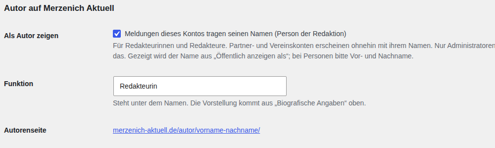

**Was dann passiert:**
- Gibt diese Person eine Meldung frei, steht ihr Name darüber, mit Link zur Autorenseite. Das gilt auch für Meldungen aus der Recherche.
- Meldungen von Polizei, Feuerwehr, Gemeinde, Vereinen und Firmen tragen deren Namen, z. B. „Polizei Düren · Polizei · geprüft von der Redaktion“.
- Was über ein gemeinsames Konto (admin, HK Growth, KBS) freigegeben wird, und alle Meldungen vor dem 7. Oktober 2026 tragen „Redaktion Merzenich Aktuell“.
- Veröffentlichte Meldungen ändern ihren Autor nicht, auch nicht beim Bearbeiten.

**Rollen:** „Redakteur“ kann alles aus Teil A. „Administrator“ zusätzlich Einstellungen, Konten und Partner. Externe (Partner) bekommen nie die Rolle „Autor“ oder „Redakteur“, sondern immer eine Partnerrolle (B2).

## B2. Partner- und Vereinszugänge

Partner reichen Meldungen, Termine und Anzeigen ein. Veröffentlichen und die Prüfhaken setzen kann nur die Redaktion.

| Rolle | Für | Darf einreichen |
|---|---|---|
| Polizei-Partner | Kreispolizeibehörde | Meldungen (Blaulicht) |
| Feuerwehr-Partner | Feuerwehr, Löschgruppe | Meldungen (Blaulicht) |
| Rathaus-Partner | Gemeinde | Meldungen (Rathaus & Politik) |
| Sport-Partner | Sportverein | Meldungen (Sport), Termine, Vereinsprofil |
| Vereins-Partner | Verein, Initiative | Meldungen (Vereine), Termine, Vereinsprofil |
| Unternehmens-Partner | Firma, Sponsor | Meldungen (als Anzeige gekennzeichnet), Unternehmensprofil, Tipps, Werbung |
| Immobilien-Partner | Makler | Immobilien |
| Werbepartner | Agentur, Werbekunde | Werbung, Tipps |

**Zugang anlegen:** **Benutzer → Partner-Zugänge**.

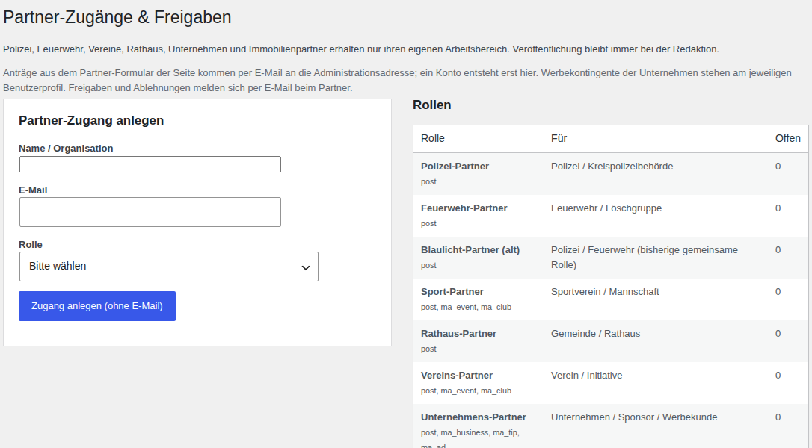

1. **Name / Organisation**, **E-Mail**, **Rolle** wählen.
2. **Zugang anlegen (ohne E-Mail)**. Es wird keine E-Mail verschickt.
3. Über den Link in der Bestätigung das Profil öffnen, ein Passwort setzen und dem Partner **persönlich** mitteilen (Telefon, nicht per E-Mail).
4. Die Mustermail aus dem Anhang schicken (ohne Passwort).

**Was Partner sehen:** nach dem Anmelden nur den Kasten **Ihr Bereich bei Merzenich Aktuell** mit Knöpfen wie **Neue Meldung schreiben** und **Termin einreichen** und einer Liste ihrer Beiträge mit Stand und Aufrufen. Sie sehen nur ihre eigenen Beiträge und Bilder. Bevor sie etwas einreichen, müssen sie die Bild- und Nutzungsrechte bestätigen.

**Einreichungen** landen in den **Freigaben** (A3). Bei Meldungen, Immobilien, Unternehmen, Tipps und Werbung gibt es im Editor zusätzlich den Kasten **Partner-Einreichung ablehnen** mit **Begründung**.

**Werbekontingent:** Im Profil eines Unternehmens unter **Werbekontingent (Merzenich Aktuell)**: **Gleichzeitig aktive Anzeigen** und **Erlaubte Plätze**.

**Vereinszugänge** (Benutzer → Vereinszugänge): Übersicht aller Vereinskonten. Je Konto: **Deaktivieren** oder **Aktivieren**, **Passwort-Link senden** (nur mit Mailversand), **Passwort im Profil setzen**. Partner tragen ihre E-Mail-Adresse selbst unter **Profil** ein.

## B3. Abgleich mit der Recherche

**Merzenich Aktuell → Abgleich** holt stündlich die neuen Meldungen und Termine aus der Recherche.
- Neue Meldungen landen als Entwurf in den Freigaben. Neue Termine erscheinen sofort.
- Einmal täglich kommen Stellen, Immobilien und der Tabellenstand der Sportvereine.
- **Jetzt abgleichen** holt den neuesten Stand sofort. Das dürfen auch Redakteure.
- **Letzter Lauf** zeigt, was neu kam, was aktualisiert wurde und welche Fehler es gab.
- Was im Backend von Hand geändert wurde, überschreibt der Abgleich nicht. Was im Papierkorb liegt, kommt nicht wieder.

**Einstellungen** (nur Administratoren):
- **Automatischer Abgleich: Stündlich laufen lassen**: bleibt an.
- **Neue Meldungen: Sofort veröffentlichen**: bleibt **aus**. Dann geht jede Meldung durch die Freigabe. Nur wenn über Tage niemand freigeben kann, wäre „an“ besser als eine Seite ohne neue Meldungen.
- **Import-Datei** und **Bilder zuerst von**: nicht ändern.

## B4. Mailversand und Redaktions-E-Mail

Damit Formular- und Kommentar-Mails zuverlässig ankommen:
1. Im IONOS-Kundenkonto ein Postfach anlegen, am besten **redaktion@merzenich-aktuell.de**.
2. **Merzenich Aktuell → Mailversand**: **Versand über SMTP – eingeschaltet** ankreuzen, als **Benutzer** die E-Mail-Adresse, als **Passwort** das Postfach-Passwort eintragen. **Server** und **Port** sind schon richtig vorbelegt. **Speichern**.
3. **Test-Mail schicken**. Kommt sie nicht an, zeigt die Seite den Fehler (zum Beispiel ein falsches Passwort).
4. Auf der Seite **Merzenich Aktuell** (oberster Menüpunkt) im Feld **Redaktions-E-Mail** dieselbe Adresse eintragen und **Speichern**. Dorthin gehen alle Formulare und Partner-Anträge.

Einsendungen stehen auch ohne Mailversand immer im Eingang.

## B5. Seiten und Einstellungen

- **Rechtstexte** und **Redaktionsseiten** (beide unter Merzenich Aktuell): Impressum, Datenschutz, Über uns, Redaktion, Grundsätze, Korrekturen, Kommentarrichtlinien, Kontakt, Werben, Anzeigen, Heute in Merzenich und weitere Seiten pflegt das System selbst. Gibt es eine neue Fassung, steht dort **Fassung … einspielen**. Wurde eine Seite von Hand geändert, überschreibt das System sie nicht und zeigt einen Hinweis. Für die Liste auf der Seite Korrekturen und den Link auf der Seite WhatsApp-Kanal ist Bearbeiten von Hand gewollt.
- **Werbung → Werbeplätze**: **Werbung global AN** und je Platz ein Haken. Ein Platz ohne Haken zeigt nichts, auch keine Musteranzeige.
- **SEO & Geo**: Bestätigungscodes für Google Search Console und Bing, offizielle Profile der Seite, Stand der Push-Nachrichten.
- **Wetter**: läuft von selbst, nichts zu tun.
- **Merzenich Aktuell** (oberster Menüpunkt, **Aktualitätscheck**): Überblick über Abgleich, Aufmacher (Warnung, wenn älter als 7 Tage), Beiträge ohne Bild, wartende Entwürfe und Mailversand.

## B6. Was nur der Betreiber erledigen kann

- [ ] Das Passwort des Kontos „HK Growth“ ändern. Eigene Konten für Tivi, Ordin und weitere anlegen (B1).
- [ ] Mailversand und Redaktions-E-Mail einrichten (B4). Danach in der Datenschutzerklärung ergänzen, dass die Mails über IONOS gehen.
- [ ] Mit IONOS den Vertrag zur Auftragsverarbeitung abschließen (im IONOS-Kundenkonto). Er regelt, dass IONOS die Daten der Seite nur im Auftrag verarbeitet.
- [ ] Google Publisher Center: die Publikation „Merzenich Aktuell“ anlegen, damit die Seite in Google News als Quelle erscheint. Den Zugriff für die automatische Auswertung richtet HK Growth Operator mit dem Betreiber ein.
- [ ] WhatsApp-Kanal anlegen und den Link auf der Seite WhatsApp-Kanal eintragen.
- [ ] Um Links aus dem Ort bitten: die Gemeinde um einen Link und die Aufnahme in den Presseverteiler, Vereine nach einem Bericht über sie. Mustertexte im Anhang. Links von Seiten aus Merzenich helfen am meisten, damit Google die Seite bei „Merzenich“ weiter oben zeigt. Nur einzeln und persönlich, keine Serienmail, keine gekauften Links.
- [ ] Echte Werbekunden und Unternehmensprofile gewinnen, nur mit schriftlicher Einwilligung.
- [ ] Bildfreigaben der Vereine einholen. Vereinsfotos nur mit Nutzungserlaubnis.
- [ ] Fehlende Symbolfotos beschaffen lassen (vor allem Polizei, Verkehr, Rettung, Türöffnung).
- [ ] Nach dem Spiel am 9. Oktober (Freialdenhoven – Merzenich) das Ergebnis unter Sport eintragen.
- [ ] iPhone: Wer die Seite schon auf dem Home-Bildschirm hat, sieht das neue „M“-Symbol erst, wenn er das Symbol neu anlegt.

---

# Anhang

## Regeln für Text und Bild

**Text**
- Erst recherchieren, dann schreiben. Jede Angabe muss in der Quelle stehen.
- Fremde Texte nie kopieren. Pressemitteilungen in eigenen Worten wiedergeben und die Quelle nennen.
- Ortsname in Titel und ersten Satz: Merzenich, Golzheim, Girbelsrath, Morschenich, Bürgewald.
- Ereignisdatum und Veröffentlichungsdatum der Quelle auseinanderhalten.
- Blaulicht: keine Namen, keine Hausnummern, keine Angaben zu Gesundheit oder Zustand von Betroffenen. Persönlichkeitsrechte von Kindern, Opfern und Angehörigen gehen vor.
- Keine anonymen Vorwürfe gegen einzelne Personen.
- Widersprüchliche Angaben benennen, nicht glätten. Offene Ergebnisse als offen kennzeichnen, nie schätzen.
- Werbung, Sponsoring und Firmenbeiträge immer als Anzeige kennzeichnen.
- Eine Meldung, die älter als 7 Tage ist, wird nicht ohne bewusste Entscheidung Aufmacher.

**Bild**
- Lieber kein Bild als ein falsches. Eigenes Foto vor Symbolbild.
- Kein erkennbares Gesicht ohne Einwilligung, kein lesbares Kennzeichen, keine Hausnummer, kein Logo als Motiv.
- Ein Foto aus dem Internet ist nicht frei. Urheber und Nutzungsrecht müssen feststehen.
- Ein Symbolbild zeigt nie ein falsches Ereignis oder einen falschen Ort. Es heißt sichtbar „Symbolbild“.
- KI-Bilder nie für echte Ereignisse. KI-Bilder sonst sichtbar kennzeichnen („Symbolbild · KI-generiert“).

## Hilfe bei Problemen

| Was | Was tun |
|---|---|
| Neue Meldungen kommen nicht an | Merzenich Aktuell → Abgleich → **Jetzt abgleichen**. Die Seite zeigt den letzten Lauf und Fehler. |
| Eine Meldung bleibt beim Veröffentlichen Entwurf | Ein Prüfhaken fehlt. Der Kasten **Freigabe** im Editor zeigt, welcher. Haken setzen, noch einmal **Veröffentlichen**. Ältere Meldungen aus der Startphase haben manchmal nicht alle Haken. |
| Eine Anzeige bleibt Entwurf | **Freigabe dokumentiert** fehlt. |
| Eine Werbung erscheint nicht | Aktiv? Start erreicht? Unter Werbeplätze Werbung und der Platz eingeschaltet? |
| Eine Seite zeigt den alten Stand | Ein paar Minuten warten (Zwischenspeicher), dann im Browser neu laden. |
| Formular-Mails kommen nicht an | Merzenich Aktuell → Mailversand → **Test-Mail schicken**. Spam-Ordner prüfen. Einsendungen stehen trotzdem im Eingang. |
| Ein Partner kommt nicht hinein | Benutzer → Vereinszugänge bzw. Partner-Zugänge: Konto aktiv? Neues Passwort im Profil setzen und persönlich mitteilen. |
| Etwas sieht falsch aus | Bildschirmfoto mit der Adresse der Seite an HK Growth Operator. |

## Begriffe von A bis Z

| Begriff | Bedeutung |
|---|---|
| Abgleich | Holt stündlich die Ergebnisse der Recherche ins Backend. |
| Aufmacher | Die große Meldung oben auf der Startseite. |
| Bildpool | Sammlung geprüfter Symbolfotos zu einem Thema. |
| Bühne | Die vier Plätze neben und unter dem Aufmacher. |
| Entwurf | Gespeichert, aber nicht öffentlich. |
| Freigabe | Ein Mensch hat geprüft und veröffentlicht. |
| Hervorhebung bis | Bis wann ein fest gesetzter Startseitenplatz gilt. |
| Kicker (Dachzeile) | Kurze Zeile über dem Titel. |
| Nur in der Rubrik | Die Meldung steht im Ressort, aber nicht auf der Startseite. |
| Partner | Polizei, Feuerwehr, Gemeinde, Verein oder Firma mit eigenem Zugang zum Einreichen. |
| Priorität | Ordnet Meldungen mit gleicher Relevanz. |
| Relevanz | Wie wichtig eine Meldung ist, 1 bis 10. Bestimmt den Platz auf der Startseite. |
| Startseiten-Freigabe | Ob eine Meldung auf die Startseite darf. Getrennt vom Veröffentlichen. |
| Symbolbild | Foto zum Thema, das nicht das Ereignis selbst zeigt. |

## Mustermails

**Antwort auf einen Partner-Antrag (Zusage)**

> Betreff: Ihr Zugang zu Merzenich Aktuell
>
> Guten Tag,
>
> vielen Dank für Ihr Interesse an Merzenich Aktuell. Wir haben für [Organisation] einen Zugang angelegt. Ihr Benutzername lautet [Benutzername]. Das Passwort teilen wir Ihnen telefonisch mit.
>
> Anmelden können Sie sich unter merzenich-aktuell.de/wp-admin. Dort finden Sie Ihren Bereich mit den Knöpfen „Neue Meldung schreiben“ und „Termin einreichen“. Bitte tragen Sie beim ersten Anmelden unter „Profil“ Ihre E-Mail-Adresse ein.
>
> Alles, was Sie einreichen, prüft die Redaktion vor der Veröffentlichung. Bitte laden Sie nur Fotos hoch, an denen Sie die Rechte haben. Auf den Fotos sollen keine Kennzeichen, erkennbaren Gesichter oder Hausnummern zu sehen sein.
>
> Mit freundlichen Grüßen
> Redaktion Merzenich Aktuell

**Antwort auf einen Partner-Antrag (Rückfrage oder Absage)**

> Betreff: Ihre Anfrage bei Merzenich Aktuell
>
> Guten Tag,
>
> vielen Dank für Ihre Anfrage. [Rückfrage: Bevor wir einen Zugang anlegen, brauchen wir noch … / Absage: Einen eigenen Zugang können wir Ihnen derzeit nicht anbieten, weil …] Ihre Hinweise und Termine nehmen wir gern über das Formular auf merzenich-aktuell.de entgegen.
>
> Mit freundlichen Grüßen
> Redaktion Merzenich Aktuell

**Bitte an die Gemeinde (Presseverteiler und Link)**

> Betreff: Merzenich Aktuell: Presseverteiler und Link auf Ihrer Website
>
> Guten Tag [Name],
>
> Merzenich Aktuell (merzenich-aktuell.de) berichtet aus der Gemeinde Merzenich mit Golzheim, Girbelsrath, Morschenich und Bürgewald: Nachrichten aus Rat und Verwaltung, Blaulicht, Vereine, Sport und Termine. Alle Inhalte sind frei zugänglich. Herausgeberin ist die KBS Management GmbH.
>
> Wir haben zwei Bitten: Nehmen Sie uns bitte in den Verteiler für Pressemitteilungen und Einladungen zu öffentlichen Sitzungen auf ([E-Mail der Redaktion]). Und wenn die Gemeinde auf ihrer Website lokale Medien oder weiterführende Links nennt, freuen wir uns über einen Eintrag: „Merzenich Aktuell – Nachrichten aus der Gemeinde Merzenich“, merzenich-aktuell.de.
>
> Mitteilungen der Gemeinde geben wir mit Quelle und Link auf gemeinde-merzenich.de wieder.
>
> Mit freundlichen Grüßen
> [Name], Redaktion Merzenich Aktuell

**Hinweis an einen Verein nach einem Bericht**

> Betreff: Bericht über [Anlass] auf Merzenich Aktuell
>
> Guten Tag [Name],
>
> wir haben über [Anlass] berichtet: [Link zur Meldung]
>
> Wenn Ihnen der Bericht gefällt, teilen Sie ihn gern auf Ihrer Vereinsseite oder in Ihren Kanälen. Stimmt etwas nicht, sagen Sie uns bitte Bescheid. Wir korrigieren das sichtbar im Artikel.
>
> Mit freundlichen Grüßen
> [Name], Redaktion Merzenich Aktuell

## Bekannte Grenzen

- Die Kontaktdaten eines Vereinsprofils (Website, Kontakt, Logo) lassen sich im Backend nicht direkt ändern. Der Verein schlägt die Änderung über seinen Zugang vor („Änderung vorschlagen“), oder HK Growth Operator trägt sie ein.
- Der Kasten **Partner-Einreichung ablehnen** fehlt bei Terminen, Vereinen, Stellen, Trauer- und Familienanzeigen. **Ablehnen** in den Freigaben funktioniert dort trotzdem.
- Eine Eilmeldungs-Funktion gibt es nicht (siehe A15).

## Kontakte

| Für | Wer |
|---|---|
| Herausgeber | KBS Management GmbH, Rheinstr. 78a, 51371 Leverkusen, info@kbs-management.tv |
| Verantwortlich für den Inhalt (§ 18 Abs. 2 MStV) | Anto-Sutharsan Jesuthasan |
| Technische Hilfe, Recherche, Bildbeschaffung | HK Growth Operator |

Technischer Stand dieser Anleitung: Theme 21.17.0 · Core-Plugin 1.27.0.
